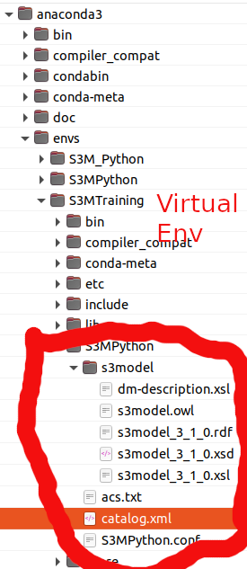
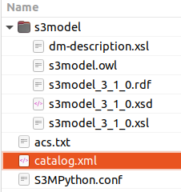

# S3MPython

[](https://travis-ci.com/s3model/S3MPython)


A Python library for creating S3Model data models.


# Examples & Training

For S3Model training courses see the [S3Model](https://s3model.com/userguide/docs/index.html) User Guide.

# Documentation

See the [S3MPython documentation](https://s3model.com/S3MPython/docs/index.html).


# Installation

For the latest release from PyPI, install into your project environment with::

  pip install S3MPython

The <path/to/release/file> is found by going to the [Releases page](https://github.com/twcook/S3M_Python/releases) under the Release you want (usually the latest) go to the Source code link, right click on it and copy the link location.::

  pip install <path/to/release/file>

# Setup

In your virtual environment the will be a directory called *S3MPython*. 



Inside this directory the are three files and a directory named *s3model*. Copy the files and the entire *s3model* folder into your project root.




In the *catalog.xml* file there are two places the the text **(path to project root)** appears. Edit these with a full project root path, removing the parens.


See the **Project Integration** section of the [documentation](https://s3model.com/S3MPython/) for the next steps.


# Development of S3MPython

Clone the master [repository](https://github.com/s3model/S3MPython/tree/master)

```
git clone git@github.com:s3model/S3MPython.git
```

Change to the new directory and using conda, build the environment.

```
cd S3MPython

conda env create -f S3MPython.yml
```

Create a new branch for your changes.


Build and install your development branch into your S3MPython environment.

```
python3 setup.py sdist bdist_wheel

pip install e .
```
